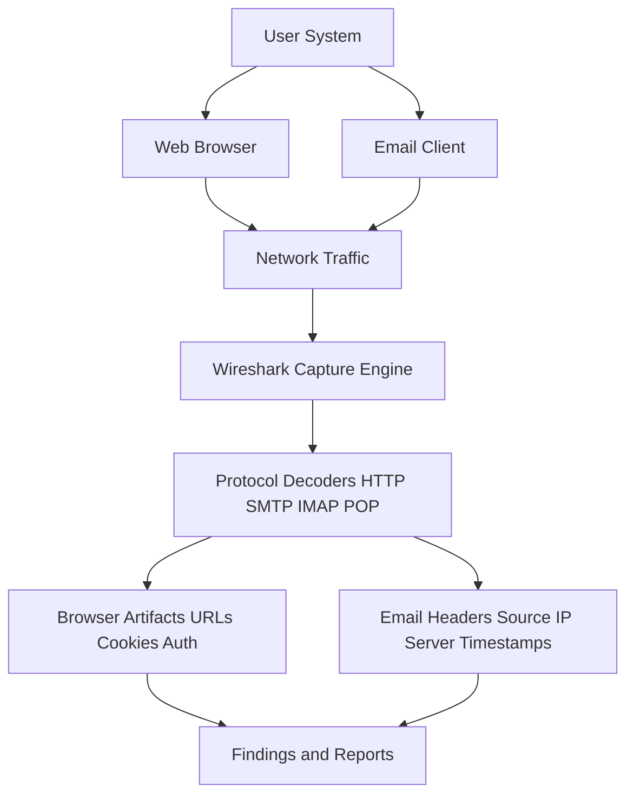

# Using-Wireshark---analyzing-web-browser-artifacts-email-header-analysis
## AIM:
To use Wireshark to analyze web browser activities and inspect email headers from captured network traffic.
## Architecture Diagram:

## DESIGN STEPS:
### Step 1:
- Install Wireshark and ensure correct network adapter selection.
- Enable packet capturing for your active interface (Wi-Fi/Ethernet).

### Step 2:
**Web Browser Artifact Analysis**
- Open a browser and visit websites with login forms (use dummy credentials).
- In Wireshark, filter traffic with:
    - ```http``` for normal HTTP requests
    - ```http.cookie``` for cookies
    - ```http.authbasic``` for basic authentication
- Identify:
    - URLs visited
    - GET/POST requests
    - Cookies & session IDs
    - Credentials (if plaintext HTTP is used)
### Step 3:
- Capture email traffic by sending/receiving emails (dummy mail server or provided PCAP).
- Use filters:
    - ```smtp``` (Simple Mail Transfer Protocol)
    - ```pop``` / ```imap``` (for received mail)
- Inspect email headers:
    - Source IP
    - Mail server hostname
    - Timestamps
    - Possible forged headers
## PROGRAM:
```mermaid
flowchart TD
    A[Start Wireshark Capture] --> B[Generate Traffic: Web Browsing & Emails]
    B --> C[Apply Protocol Filters: HTTP/SMTP/IMAP/POP]
    C --> D[Extract Browser Artifacts: URLs, Cookies, Credentials]
    C --> E[Analyze Email Headers: Source, Server, Metadata]
    D --> F[Save Findings]
    E --> F[Save Findings]
    F --> G[Generate Digital Forensic Report]

## A.Capturing Traffic in Wireshark
1.Open Wireshark and start capturing on the active interface (Wi- Fi/Ethernet).


2.Perform activities like opening a website or sending an email through a client (e.g., Gmail via browser or Thunderbird).

4.Stop the capture once done.

## B. Analyzing Web Browser Artifacts
1.Apply filters like: http, tcp.port == 443 (for HTTPS), or dns to isolate browser traffic.


2.Inspect HTTP GET/POST requests: o Look for URLs, hostnames, user agents, and cookies in the HTTP headers. o Follow TCP Stream to reconstruct page request flow: ▪ Right-click a packet → Follow → TCP Stream.

Analyze DNS Queries: o Filter: dns o Reveal domains the browser tried to resolve.

## C. Email Header Analysis
1.Apply relevant filters: o For POP3: tcp.port == 110 o For SMTP: tcp.port == 25 or 587 o For IMAP: tcp.port == 143 or 993

3.Locate email data: o Look for SMTP packets to see sender/receiver email addresses. o Use "Follow TCP Stream" to view the full email headers and body if unencrypted.

5.Extract Email Header Fields: o Analyze From, To, Subject, Date, Message-ID, and relay servers used in sending the email.


```

## OUTPUT:
Captured Web Activity and Email Header Information

## RESULT:
Web browser artifacts and email headers were successfully analyzed using Wireshark.

